# PetAid — Database Design

> SWE30003 Software Architectures & Design — Assignment 3 (detailed design ▸ database design).
> This document is the relational realisation of the PetAid object-oriented domain model.
> It pairs with [`schema.sql`](./schema.sql) (runnable DDL) and is meant to be quoted/screenshotted
> directly in the report.

- **DBMS:** PostgreSQL 16 (hosted on **Supabase**; identical schema runs on local Postgres for development)
- **Access layer:** SQLAlchemy 2.0 ORM (async) + asyncpg — the ORM classes in `app/models/` are the single source of truth; `schema.sql` is generated from them
- **Identifiers:** every table uses a UUID surrogate primary key (`gen_random_uuid()`)
- **Tables:** 16 (13 entity tables, 2 composed value-holder tables, 1 many-to-many link table)

---

## 1. From objects to tables (mapping strategy)

The Assignment 2 class model is preserved 1:1 in the database using standard OO→relational patterns:

| OO concept (Assignment 2 / SRS) | Relational realisation |
| --- | --- |
| **Inheritance** — `Account` ⟶ `PetOwner`, `VeterinaryExpert` | **Single-table inheritance**: one `accounts` table with a `role` discriminator column (`pet_owner` / `veterinary_expert`). Avoids joins on every auth check and keeps the shared identity in one place. |
| **Composition** — `Account ◆— UserCredentials`, `Donation ◆— DonationRecord`, `Feedback ◆— FeedbackEntry` | Separate child table with a **`UNIQUE` foreign key + `ON DELETE CASCADE`** — the part cannot exist without, or outlive, its whole. |
| **Aggregation** — `PetOwner ◇— Pet`, owner ◇— Inquiry/Chat/Donation/QuizAttempt/Feedback | Plain foreign key to the owning `accounts.id`. |
| **Association (1‑to‑many)** — `Chat —< ChatMessage`, `Quiz —< QuizAttempt` | Foreign key on the “many” side. |
| **Association (many‑to‑many)** — `FirstAidGuidance >—< Resource` | Junction table `first_aid_resource_link` with a composite primary key. |
| **Polymorphic association** — `Feedback → (Resource | FirstAidGuidance)` | `(target_type, target_id)` pair (discriminator + UUID), mirroring the UML’s polymorphic link. |
| **Value-object collections** — guidance `steps`, quiz `questions`, attempt `answers`, inquiry `image_urls` | Stored as **`JSONB`** columns. The SRS 2.2.3 simplification justifies collapsing ordered/owned value lists into the parent rather than creating child tables whose only purpose is a `position` column. |
| **State machines** — Inquiry, Chat, Resource, Donation lifecycles | `status` column constrained by a `CHECK` to the legal enum values; transitions are enforced by entity methods (`inquiry.respond()`, `chat.join()`, …). |

**Conventions applied to every entity table** (via two mixins):

- `id UUID PRIMARY KEY DEFAULT gen_random_uuid()`
- `created_at`, `updated_at` — `TIMESTAMPTZ NOT NULL DEFAULT now()` (`updated_at` is bumped on write)

---

## 2. Entity–Relationship Diagram

```mermaid
erDiagram
    accounts ||--o| user_credentials : "1:1 (composition)"
    accounts ||--o{ pets : "owns"
    pet_types ||--o{ pets : "classifies"
    pet_types ||--o{ resources : "groups"
    pet_types ||--o{ first_aid_guidance : "filters"
    accounts ||--o{ resources : "authors (vet)"
    accounts ||--o{ first_aid_guidance : "authors (vet)"
    first_aid_guidance ||--o{ first_aid_resource_link : ""
    resources ||--o{ first_aid_resource_link : ""
    resources ||--o{ quizzes : "assesses"
    quizzes ||--o{ quiz_attempts : "attempted in"
    accounts ||--o{ quiz_attempts : "by owner"
    accounts ||--o{ inquiries : "raises (owner)"
    accounts ||--o{ inquiries : "assigned (vet)"
    accounts ||--o{ chats : "starts (owner)"
    accounts ||--o{ chats : "joins (vet)"
    chats ||--o{ chat_messages : "contains"
    accounts ||--o{ chat_messages : "sends"
    accounts ||--o{ donations : "makes"
    donations ||--o| donation_records : "1:1 (composition)"
    accounts ||--o{ feedback : "submits"
    feedback ||--o| feedback_entries : "1:1 (composition)"

    accounts {
        uuid id PK
        varchar full_name
        varchar role "pet_owner | veterinary_expert"
        bool email_verified
    }
    user_credentials {
        uuid id PK
        uuid account_id FK "UNIQUE"
        varchar email "UNIQUE"
        varchar hashed_password
        bool mfa_enabled
        varchar mfa_secret
        int failed_attempts
        timestamptz locked_until
    }
    pet_types {
        uuid id PK
        varchar name "UNIQUE"
        varchar icon_emoji
    }
    pets {
        uuid id PK
        uuid owner_id FK
        uuid pet_type_id FK
        varchar name
        int age_years
    }
    resources {
        uuid id PK
        uuid pet_type_id FK
        uuid author_id FK
        varchar title
        varchar status "draft | published"
    }
    first_aid_guidance {
        uuid id PK
        uuid pet_type_id FK
        uuid author_id FK
        varchar emergency_type
        jsonb steps
    }
    first_aid_resource_link {
        uuid guidance_id PK,FK
        uuid resource_id PK,FK
    }
    quizzes {
        uuid id PK
        uuid resource_id FK
        int passing_score
        jsonb questions
    }
    quiz_attempts {
        uuid id PK
        uuid pet_owner_id FK
        uuid quiz_id FK
        int score_pct
        bool passed
    }
    inquiries {
        uuid id PK
        uuid pet_owner_id FK
        uuid assigned_vet_id FK
        varchar status "pending | responded | closed"
        jsonb image_urls
    }
    chats {
        uuid id PK
        uuid pet_owner_id FK
        uuid vet_id FK
        varchar status "initiated | active | closed"
        timestamptz owner_last_read_at
        timestamptz vet_last_read_at
    }
    chat_messages {
        uuid id PK
        uuid chat_id FK
        uuid sender_id FK
        text body
        text image_url
    }
    donations {
        uuid id PK
        uuid pet_owner_id FK
        int amount_cents
        varchar status "pending | succeeded | failed"
    }
    donation_records {
        uuid id PK
        uuid donation_id FK "UNIQUE"
        varchar transaction_ref "UNIQUE"
        varchar final_status
    }
    feedback {
        uuid id PK
        uuid submitter_id FK
        varchar target_type "resource | guidance"
        uuid target_id
        bool flagged
    }
    feedback_entries {
        uuid id PK
        uuid feedback_id FK "UNIQUE"
        int rating "1..5"
        text comment
    }
```



> The diagram above renders on GitHub and in most Markdown/Mermaid viewers. For the report you can
> either screenshot it, or — once the schema is loaded into Supabase — use **Supabase ▸ Database ▸
> Schema Visualizer** to export an auto-laid-out ERD (see §6).

---

## 3. Data dictionary

Legend: **PK** primary key · **FK** foreign key · **U** unique · **NN** not null · all tables also
carry `created_at` and `updated_at` (`timestamptz NOT NULL DEFAULT now()`), omitted below for brevity.

### 3.1 `accounts` — user identity (Account / PetOwner / VeterinaryExpert)
Single-table inheritance; `role` is the discriminator. (SRS 3.3.8–3.3.10)

| Column | Type | Constraints | Description |
| --- | --- | --- | --- |
| id | uuid | PK | Surrogate key |
| full_name | varchar(120) | NN | Display name |
| initials | varchar(4) | NN | Avatar initials |
| is_active | boolean | NN | Account enabled |
| email_verified | boolean | NN | Email confirmed before login |
| role | varchar(40) | NN, indexed, CHECK | `pet_owner` \| `veterinary_expert` |

### 3.2 `user_credentials` — secrets & auth state (composition of Account, 1:1)
Physically separated so password/MFA columns are isolated; only `AuthManager` reads it. (SRS 3.3.20)

| Column | Type | Constraints | Description |
| --- | --- | --- | --- |
| id | uuid | PK | |
| account_id | uuid | FK→accounts, U, NN | Owning account (cascade delete) |
| email | varchar(255) | U, NN | Login identifier |
| hashed_password | varchar(255) | NN | bcrypt hash (never plaintext) |
| mfa_enabled | boolean | NN | TOTP enforced (vets) |
| mfa_secret | varchar(64) | nullable | Base32 TOTP secret |
| failed_attempts | integer | NN | Lockout counter |
| locked_until | timestamptz | nullable | Lockout expiry (5-fail / 30-s rule) |

### 3.3 `pet_types` — animal classification (SRS 3.3.12)

| Column | Type | Constraints | Description |
| --- | --- | --- | --- |
| id | uuid | PK | |
| name | varchar(60) | U, NN | e.g. Dog, Cat |
| description | varchar(240) | NN | |
| icon_emoji | varchar(8) | NN | Default avatar glyph |
| icon_bg | varchar(16) | NN | Avatar background colour |
| sort_order | integer | NN | Display order |

### 3.4 `pets` — a pet owned by a Pet Owner (SRS 3.3.11)

| Column | Type | Constraints | Description |
| --- | --- | --- | --- |
| id | uuid | PK | |
| owner_id | uuid | FK→accounts, NN | Owning Pet Owner (cascade) |
| pet_type_id | uuid | FK→pet_types, NN | Restrict delete of in-use type |
| name | varchar(80) | NN | |
| breed | varchar(80) | nullable | |
| age_years | integer | nullable | |
| health_notes | text | NN | Free-text notes for the vet |
| image_url | text | nullable | Uploaded photo (data/remote URL) |
| icon_emoji | varchar(16) | nullable | Chosen avatar icon (overrides type) |

### 3.5 `resources` — learning content (SRS 3.3.14)

| Column | Type | Constraints | Description |
| --- | --- | --- | --- |
| id | uuid | PK | |
| pet_type_id | uuid | FK→pet_types, NN | Grouping |
| author_id | uuid | FK→accounts, NN | Authoring vet (restrict) |
| title | varchar(160) | NN | |
| content_type | varchar(20) | NN | `video` \| `pdf` \| `images` |
| media_path | varchar(500) | nullable | Path from media-storage layer |
| status | varchar(9) | NN, indexed, CHECK | `draft` \| `published` |

### 3.6 `first_aid_guidance` — emergency protocol (SRS 3.3.13)

| Column | Type | Constraints | Description |
| --- | --- | --- | --- |
| id | uuid | PK | |
| pet_type_id | uuid | FK→pet_types, NN | Filter |
| author_id | uuid | FK→accounts, NN | Authoring vet (restrict) |
| title | varchar(160) | NN | |
| emergency_type | varchar(60) | NN, indexed | e.g. cardiac, poisoning |
| summary | text | NN | |
| steps | jsonb | NN | Ordered list of step strings |

### 3.7 `first_aid_resource_link` — guidance ↔ resource (M2M)

| Column | Type | Constraints | Description |
| --- | --- | --- | --- |
| guidance_id | uuid | PK, FK→first_aid_guidance | Composite PK part 1 (cascade) |
| resource_id | uuid | PK, FK→resources | Composite PK part 2 (cascade) |

### 3.8 `quizzes` — assessment linked to one Resource (SRS 3.3.15)

| Column | Type | Constraints | Description |
| --- | --- | --- | --- |
| id | uuid | PK | |
| resource_id | uuid | FK→resources, NN | Learning material (cascade) |
| title | varchar(160) | NN | |
| passing_score | integer | NN | Pass threshold (%) |
| questions | jsonb | NN | `[{prompt, options[], answer_index}]` |

### 3.9 `quiz_attempts` — one owner attempt (SRS 3.3.15)

| Column | Type | Constraints | Description |
| --- | --- | --- | --- |
| id | uuid | PK | |
| pet_owner_id | uuid | FK→accounts, NN | Attempting owner (cascade) |
| quiz_id | uuid | FK→quizzes, NN | (cascade) |
| score_pct | integer | NN, CHECK 0..100 | Computed by `Quiz.evaluate()` |
| passed | boolean | NN | `score_pct ≥ passing_score` |
| answers | jsonb | NN | Submitted answer indices |
| completed_at | timestamptz | NN | |

### 3.10 `inquiries` — async owner→vet question (SRS 3.3.16)

| Column | Type | Constraints | Description |
| --- | --- | --- | --- |
| id | uuid | PK | |
| pet_owner_id | uuid | FK→accounts, NN | Asker (cascade) |
| assigned_vet_id | uuid | FK→accounts, nullable | Claimed by vet (set null on delete) |
| subject | varchar(160) | NN | |
| question | text | NN | |
| response | text | nullable | Vet’s reply |
| image_urls | jsonb | NN, default `[]` | Attached condition photos |
| status | varchar(9) | NN, indexed, CHECK | `pending` \| `responded` \| `closed` |
| submitted_at / responded_at / closed_at | timestamptz | submitted NN; others nullable | Lifecycle timestamps |

### 3.11 `chats` — real-time owner↔vet session (SRS 3.3.17)

| Column | Type | Constraints | Description |
| --- | --- | --- | --- |
| id | uuid | PK | |
| pet_owner_id | uuid | FK→accounts, NN | Initiator (cascade) |
| vet_id | uuid | FK→accounts, nullable | Joiner (set null on delete) |
| subject | varchar(160) | NN | |
| status | varchar(9) | NN, indexed, CHECK | `initiated` \| `active` \| `closed` |
| started_at | timestamptz | NN | |
| ended_at | timestamptz | nullable | |
| owner_last_read_at | timestamptz | nullable | Read cursor → unread + “Seen” |
| vet_last_read_at | timestamptz | nullable | Read cursor → unread + “Seen” |

> **Design note (Assignment 3 extension):** the two `*_last_read_at` cursors were added during
> implementation to support real-time read receipts and unread badges. Because a chat has exactly two
> participants, two columns are simpler and faster than a separate `ChatParticipant` table. Justified
> in the report’s “changes to the design” section.

### 3.12 `chat_messages` — one message in a chat (SRS 3.3.17)

| Column | Type | Constraints | Description |
| --- | --- | --- | --- |
| id | uuid | PK | |
| chat_id | uuid | FK→chats, NN | (cascade) |
| sender_id | uuid | FK→accounts, NN | (cascade) |
| body | text | NN, default `''` | Message text (may be empty if image-only) |
| image_url | text | nullable | In-chat photo |
| sent_at | timestamptz | NN | |

### 3.13 `donations` — voluntary contribution (SRS 3.3.18)

| Column | Type | Constraints | Description |
| --- | --- | --- | --- |
| id | uuid | PK | |
| pet_owner_id | uuid | FK→accounts, NN | Donor (cascade) |
| amount_cents | integer | NN | Minor units (avoids float money) |
| currency | varchar(3) | NN | ISO-4217 (default `MYR`) |
| status | varchar(9) | NN, indexed, CHECK | `pending` \| `succeeded` \| `failed` |
| recurring | boolean | NN | Monthly repeat flag |

### 3.14 `donation_records` — immutable transaction outcome (composition, 1:1; SRS 3.3.21)

| Column | Type | Constraints | Description |
| --- | --- | --- | --- |
| id | uuid | PK | |
| donation_id | uuid | FK→donations, U, NN | (cascade) |
| transaction_ref | varchar(120) | U, NN | Provider reference |
| provider | varchar(40) | NN | Payment adapter name |
| amount_cents / currency | integer / varchar(3) | NN | Snapshot at capture |
| final_status | varchar(20) | NN | Outcome string |
| processed_at | timestamptz | NN | |

> Write-once for financial integrity (SRS A4): no method mutates a record after insert.

### 3.15 `feedback` — rating on content, polymorphic target (SRS 3.3.19)

| Column | Type | Constraints | Description |
| --- | --- | --- | --- |
| id | uuid | PK | |
| submitter_id | uuid | FK→accounts, NN | (cascade) |
| target_type | varchar(8) | NN, indexed, CHECK | `resource` \| `guidance` |
| target_id | uuid | NN, indexed | UUID of the targeted content |
| flagged | boolean | NN, indexed | Needs vet review |

### 3.16 `feedback_entries` — rating & comment (composition, 1:1; SRS 3.3.22)

| Column | Type | Constraints | Description |
| --- | --- | --- | --- |
| id | uuid | PK | |
| feedback_id | uuid | FK→feedback, U, NN | (cascade) |
| rating | integer | NN, CHECK 1..5 | Star rating |
| comment | text | NN, default `''` | Optional comment |

---

## 4. Referential integrity (delete behaviour)

| Parent | Child | On delete | Rationale |
| --- | --- | --- | --- |
| accounts | user_credentials, pets, inquiries(owner), chats(owner), chat_messages, donations, quiz_attempts, feedback | **CASCADE** | A removed account takes its owned data with it. |
| accounts | inquiries.assigned_vet_id, chats.vet_id | **SET NULL** | A vet leaving must not delete the owner’s history. |
| accounts | resources.author_id, first_aid_guidance.author_id | **RESTRICT** | Cannot delete a vet who still authors published content. |
| pet_types | pets, resources, first_aid_guidance | **RESTRICT** | A classification in use cannot be deleted. |
| donations | donation_records | CASCADE | Composition. |
| feedback | feedback_entries | CASCADE | Composition. |
| chats | chat_messages | CASCADE | A thread owns its messages. |
| first_aid_guidance / resources | first_aid_resource_link | CASCADE | Junction rows clean up with either side. |

---

## 5. Indexing

Every foreign key is indexed (lookup/join performance) plus:

- **Unique:** `pet_types.name`, `user_credentials.email`, `user_credentials.account_id`,
  `donation_records.donation_id`, `donation_records.transaction_ref`, `feedback_entries.feedback_id`.
- **Filter indexes:** `accounts.role`, `*.status` (chats/inquiries/resources/donations),
  `first_aid_guidance.emergency_type`, `feedback.flagged`, `feedback.target_type`, `feedback.target_id`.

---

## 6. Deploying the schema to Supabase & exporting the ERD

You have two equivalent ways to create the schema in your Supabase project; pick one.

### Option A — SQL Editor (no local setup, recommended for the report)
1. Open the [Supabase dashboard](https://supabase.com/dashboard) → your project.
2. **SQL Editor → New query**.
3. Paste the entire contents of [`schema.sql`](./schema.sql) and click **Run** (run once, on an empty `public` schema).
4. (Optional) seed demo rows: see Option B step 3, or insert manually.
5. **Database → Schema Visualizer** → arrange → **Download / screenshot** the diagram for the report.

### Option B — point the backend at Supabase and let it build + seed
1. In Supabase: **Project Settings → Database → Connection string → URI** (use the **Session pooler**).
2. In `petaid-backend/.env`, set the asyncpg URL (see [`SUPABASE.md`](../../SUPABASE.md)):
   ```dotenv
   DATABASE_URL=postgresql+asyncpg://postgres.<project-ref>:<DB-PASSWORD>@aws-1-<region>.pooler.supabase.com:5432/postgres
   DB_SSL=true
   ```
3. Create every table **and** insert the two demo accounts + sample content:
   ```bash
   python -m app.seed
   ```
4. Export the diagram from **Database → Schema Visualizer**.

> Note: the publishable/anon key you have is for Supabase’s REST/JS client (PostgREST) and **cannot
> run DDL**. Schema creation needs either the SQL Editor (Option A, authenticated via the dashboard)
> or the database connection string (Option B). PetAid’s frontend talks to the FastAPI backend, not
> directly to Supabase, so the anon key is not used by this project.

---

## 7. Files

| File | Purpose |
| --- | --- |
| [`schema.sql`](./schema.sql) | Runnable PostgreSQL DDL (16 tables, FKs, indexes, CHECK constraints) |
| [`DATABASE.md`](./DATABASE.md) | This document — ERD + data dictionary + design rationale |
| `app/models/*.py` | Canonical ORM definitions (source of truth; `schema.sql` is generated from them) |
