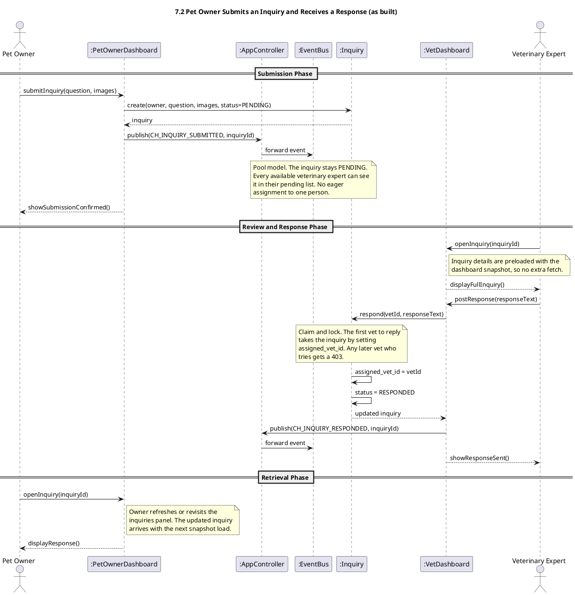
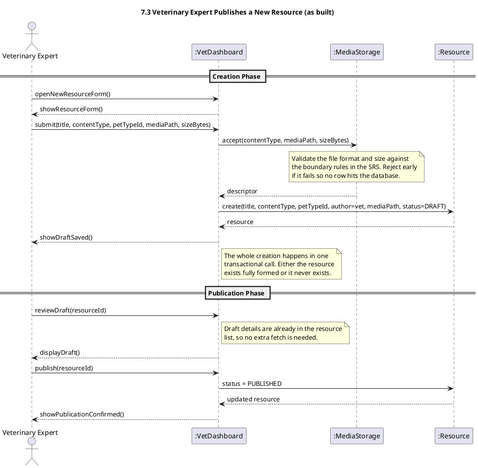

# PetAid Revised Sequence Diagrams

This file collects sequence diagrams that the as built code follows in a way that differs from the original. Each section shows the revised PlantUML and a short reason for the change. The file grows as more diagrams are revised.

---

## 7.2 Pet Owner Submits an Inquiry and Receives a Response

### Why the change

The original 7.2 diagram routes a new inquiry to one chosen veterinary expert at the moment of submission. The as built code uses a pool model instead. Every available expert sees the pending inquiry, and the first one who replies claims it. A claim and lock check then prevents any other expert from overwriting that reply. This closes a real authorisation gap and balances the load across the team without extra routing logic. The AppController publishes inquiry events through the EventBus. Real time push to the Pet Owner is left out on purpose because the SRS treats inquiry as an asynchronous channel.

---

## 7.3 Veterinary Expert Publishes a New Resource

### Why the change

The original 7.3 diagram splits resource creation into many small steps. It expects an empty draft to be created up front, then media uploaded, then pet type linked, then guidance linked, then publication. The as built code uses a single atomic create call followed by a separate publish call. MediaStorage validates the file metadata inline during create, so the resource is either saved fully formed or not at all. The pet type is a required column on the resource and is set during create, not as a later link step. Publication is the only state change after creation, moving the status from DRAFT to PUBLISHED. Runtime linking of a resource to a FirstAidGuidance is not implemented as a separate function in this flow.

---
