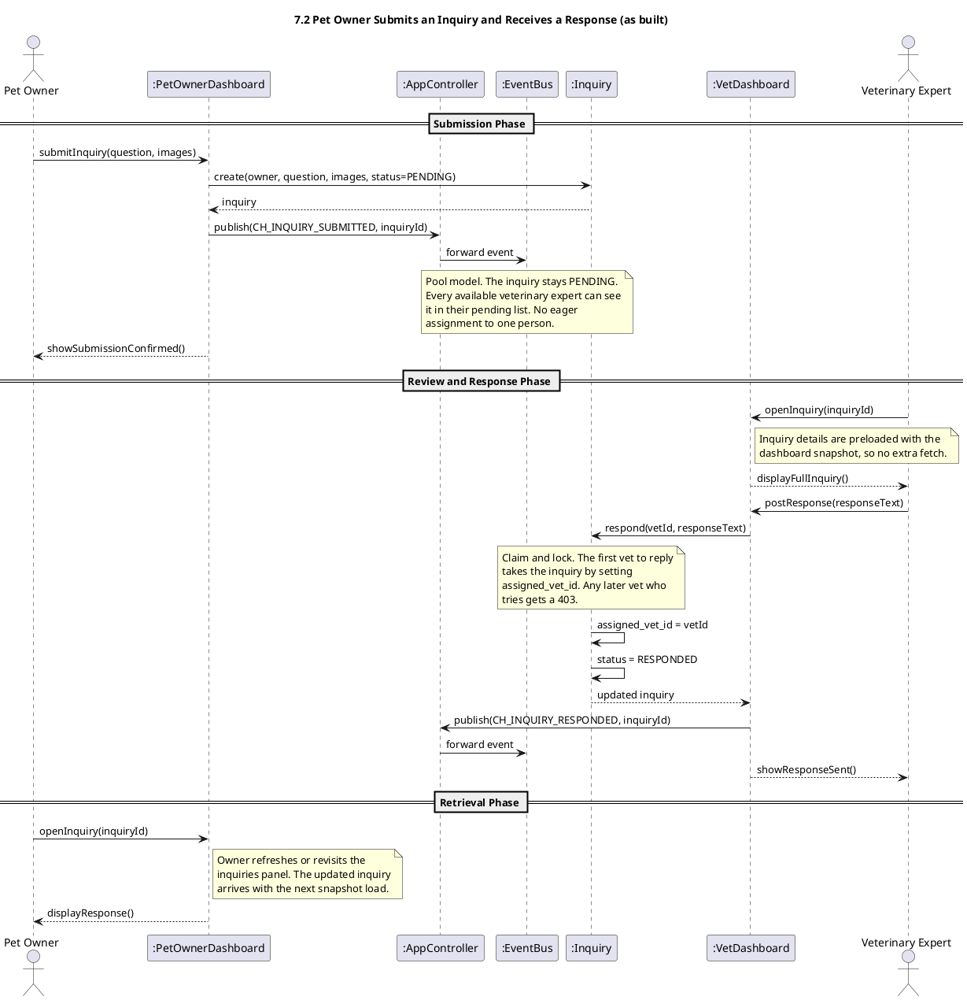
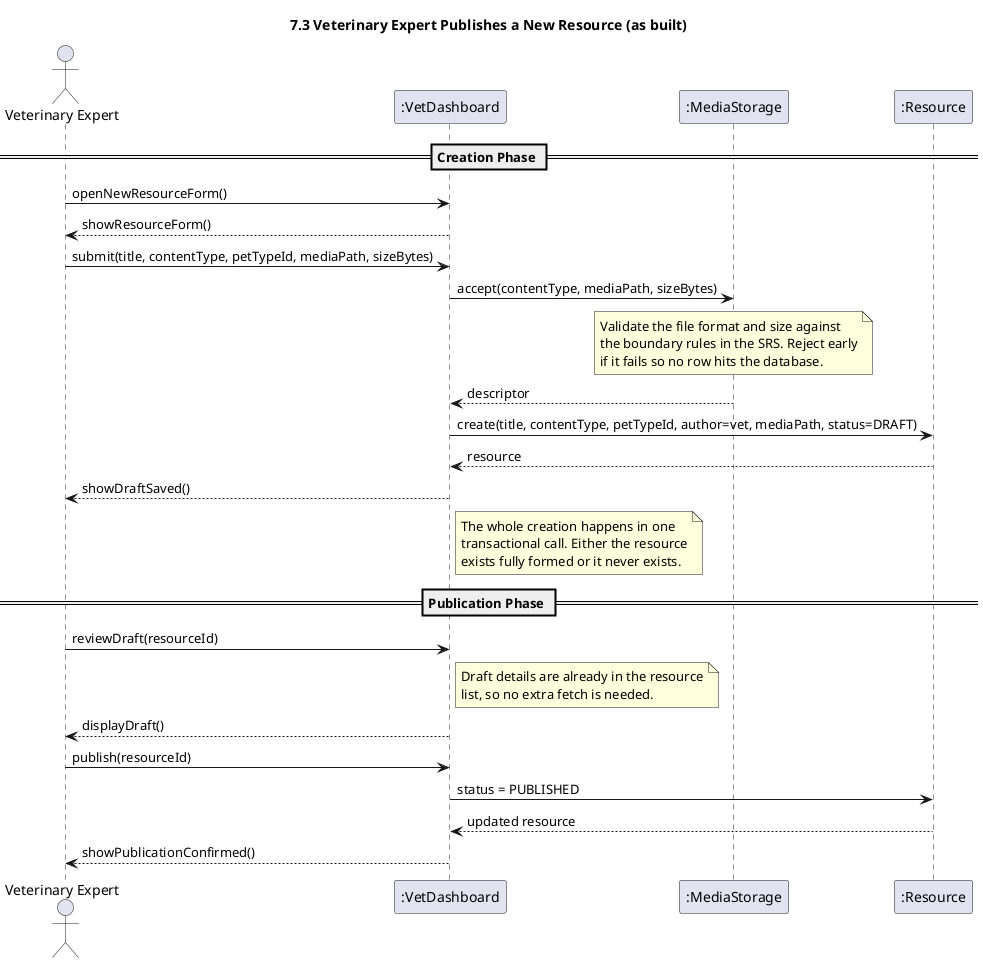
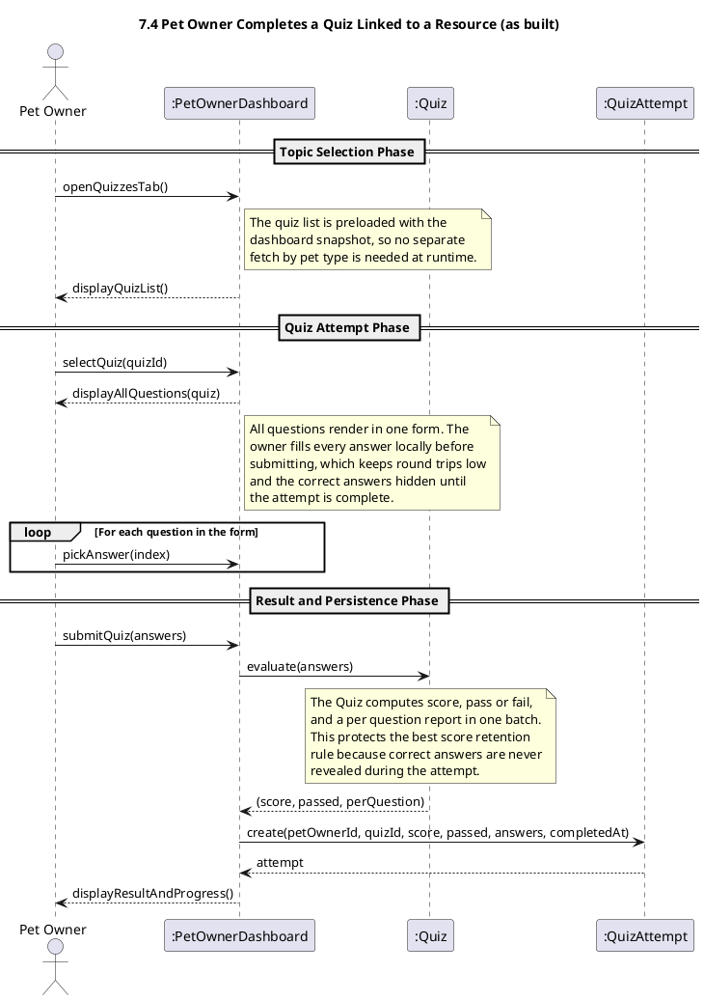
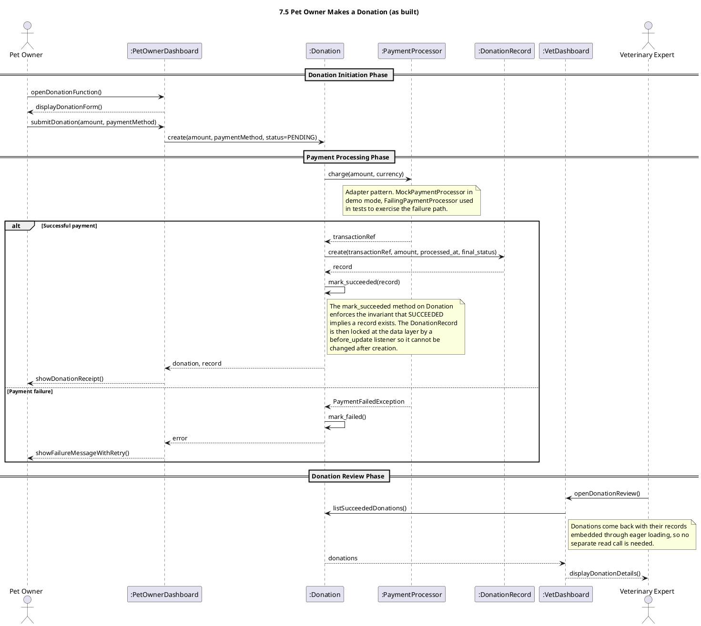
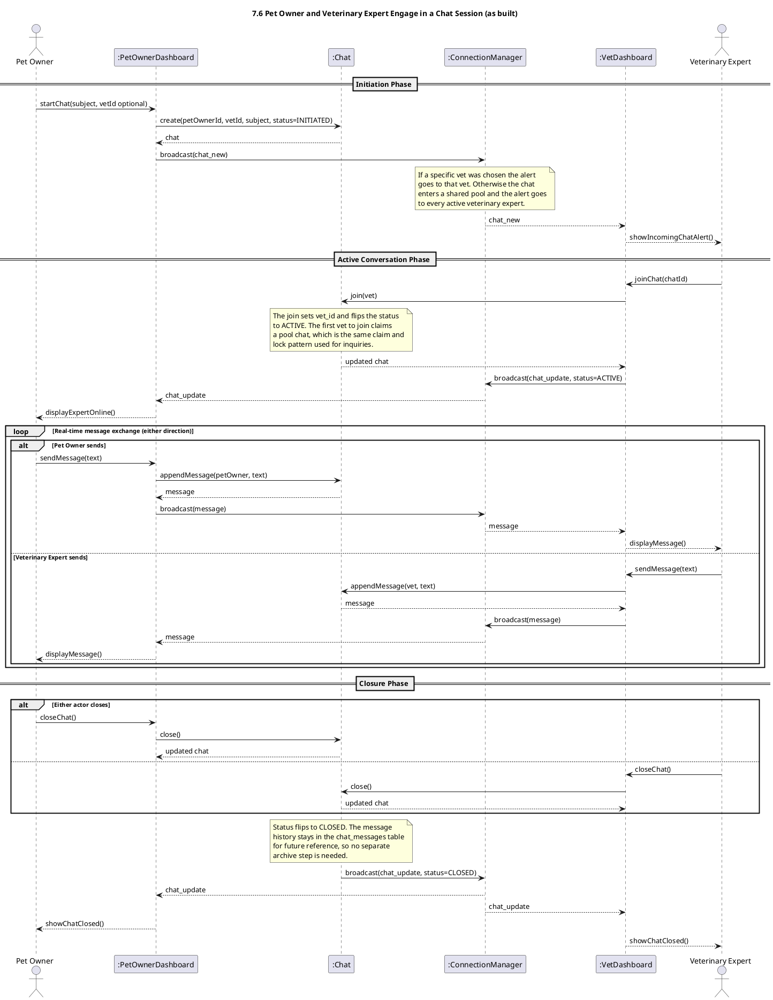
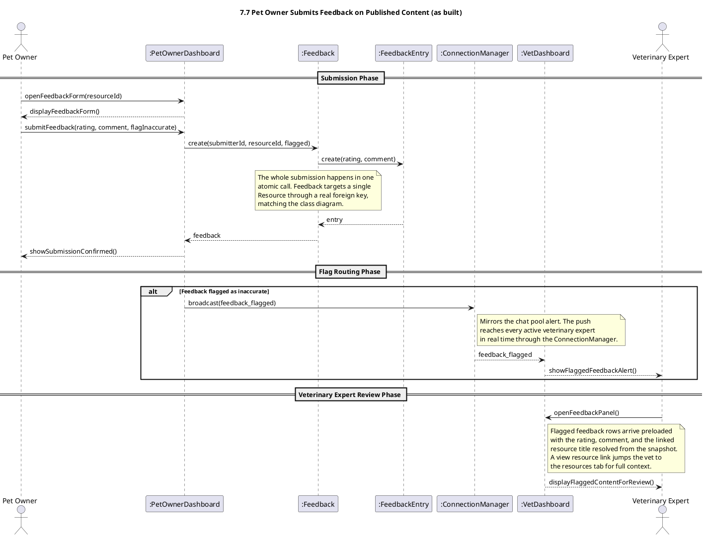
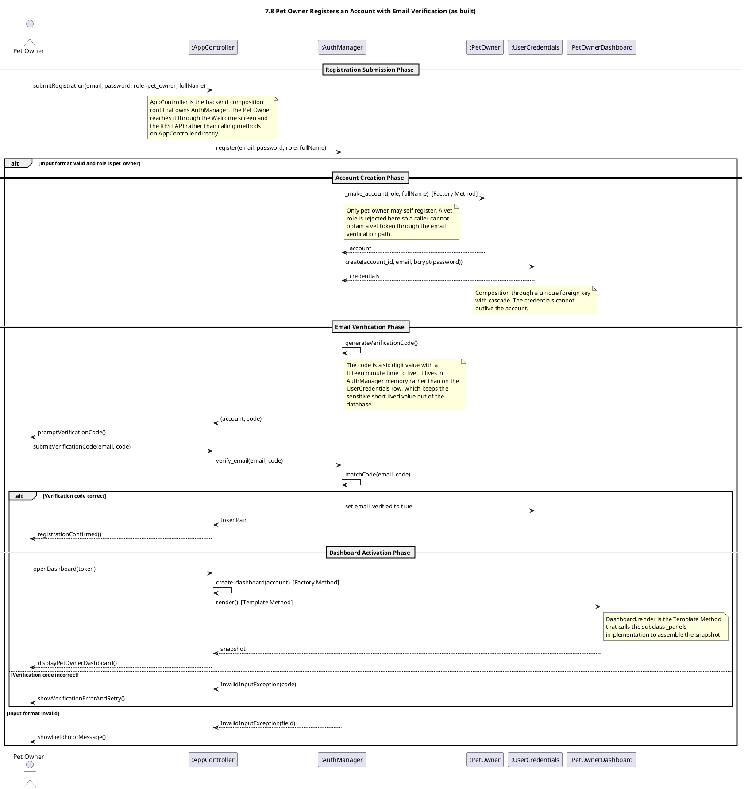

# PetAid Revised Sequence Diagrams

This file collects sequence diagrams that the as built code follows in a way that differs from the original. Each section shows the revised PlantUML and a short reason for the change. The file grows as more diagrams are revised.

---

## 7.2 Pet Owner Submits an Inquiry and Receives a Response

### Why the change

The original 7.2 diagram routes a new inquiry to one chosen veterinary expert at the moment of submission. The as built code uses a pool model instead. Every available expert sees the pending inquiry, and the first one who replies claims it. A claim and lock check then prevents any other expert from overwriting that reply. This closes a real authorisation gap and balances the load across the team without extra routing logic. The AppController publishes inquiry events through the EventBus. Real time push to the Pet Owner is left out on purpose because the SRS treats inquiry as an asynchronous channel.

---

## 7.3 Veterinary Expert Publishes a New Resource

### Why the change

The original 7.3 diagram splits resource creation into many small steps. It expects an empty draft to be created up front, then media uploaded, then pet type linked, then guidance linked, then publication. The as built code uses a single atomic create call followed by a separate publish call. MediaStorage validates the file metadata inline during create, so the resource is either saved fully formed or not at all. The pet type is a required column on the resource and is set during create, not as a later link step. Publication is the only state change after creation, moving the status from DRAFT to PUBLISHED. Runtime linking of a resource to a FirstAidGuidance is not implemented as a separate function in this flow.

---

## 7.4 Pet Owner Completes a Quiz Linked to a Resource

### Why the change

The original 7.4 diagram has the owner pick answers one at a time, with the software evaluating each answer during the attempt and revealing the correct one before the quiz ends. The as built code uses batch evaluation. The owner answers every question in a single form, then a single submit call sends all answers, the Quiz computes score and per question feedback in one pass, and the result is persisted as a QuizAttempt. This keeps the highest score retention rule honest, because correct answers are never visible while the attempt is in progress, and it removes the extra round trips between the owner and the software for each question. The list of quizzes also comes preloaded with the dashboard snapshot rather than a runtime pet type lookup.

---

## 7.5 Pet Owner Makes a Donation

### Why the change

The original 7.5 diagram and the as built code line up closely already. Both use the Adapter pattern through PaymentProcessor, both create the immutable DonationRecord through composition only on success, and both handle the failure path with a clear status. The small adjustments needed to follow the diagram fully were made in code rather than in the drawing. Donation now exposes mark_succeeded and mark_failed methods so the status transition lives on the entity instead of in the router, the payment method label is now carried through from the form to the donation row, and DonationRecord is protected by a before_update listener that refuses any change after insert. With those in place the diagram and the software describe the same flow.

---

## 7.6 Pet Owner and Veterinary Expert Engage in a Chat Session

### Why the change

The original 7.6 diagram routes a new chat to one chosen veterinary expert at creation. The as built code uses a pool model. When the owner picks a specific expert the chat goes directly to that person, otherwise it enters a shared pool and the alert reaches every active expert through the ConnectionManager. The first expert to join claims the chat, flips the status to ACTIVE, and from that point messages flow in both directions through the WebSocket Observer layer. Either actor may close the chat, which flips the status to CLOSED and broadcasts to both sides. The diagram shows an archiveMessageHistory self call but the code keeps history in place by leaving the chat_messages rows after closure, which retains the conversation for future reference without a separate archive store.

---

## 7.7 Pet Owner Submits Feedback on Published Content

### Why the change

The original 7.7 diagram has an alt branch where feedback targets either a FirstAidguidance or a Resource. That conflicts with the class diagram, which shows Feedback targeting a Resource only. The as built code follows the class diagram, so feedback uses a single resource_id foreign key and the alt branch is gone. The submission also happens in one atomic call rather than separate create and assignTarget steps, which keeps the data consistent. The flag routing path is now wired end to end. The router publishes the event on the EventBus and also broadcasts a real time alert through the ConnectionManager to every active veterinary expert, mirroring the chat pool model. The vet panel shows the flagged feedback with the linked resource title resolved from the snapshot, plus a small link that opens the resources tab for full context.

---

## 7.8 Pet Owner Registers an Account with Email Verification

### Why the change

The original 7.8 diagram has the user talk directly to AppController and shows UserCredentials generating the verification code. The as built code follows the same shape with two small adaptations. AppController is the backend composition root that owns AuthManager, and the Pet Owner reaches it through the Welcome screen and the REST API rather than by calling AppController methods directly. The verification code lives in AuthManager memory with a fifteen minute time to live rather than on a UserCredentials column, which keeps the sensitive short lived value out of the database. The Factory Method on AuthManager and the Template Method on Dashboard.render are realised exactly as drawn. Only pet_owner may self register, so a vet token cannot be obtained through the verification path.

---
